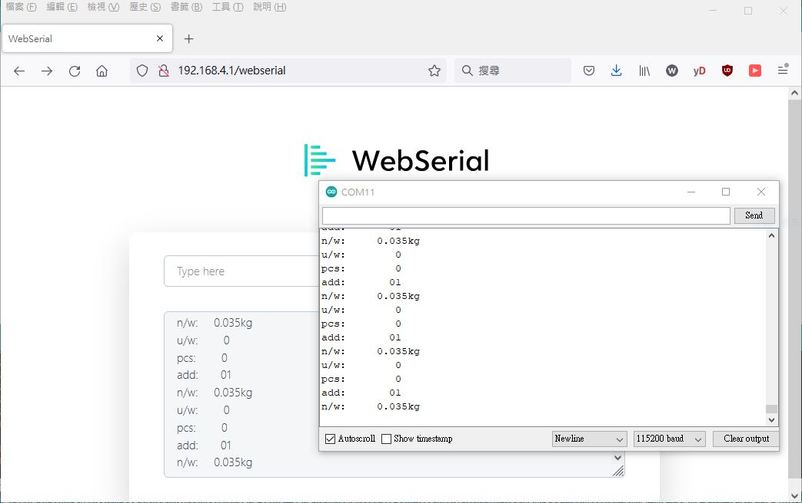

# ESP8266_WebSerial_testing
clone, no fork, dummy SoftwareSerial port read and relay to WebSerial

ref : https://www.arduino.cc/reference/en/libraries/webserial/


  


ssid and pwd  
```
const char* ssid = "SoftwareSerial relay to WebSerial AP"; // Your WiFi AP SSID 
const char* password = "123456789"; // Your WiFi Password
```


setup SoftwareSerial
```
void setup() {
    testSerial.begin(SoftwareSerial_BAUD_RATE, SWSERIAL_8N1, D7, D8, false, 95, 11); // my weight scale UART output, 9600 N81
    usbSerial.println(PSTR("\nSoftware serial 9600 BAUD test started"));
```


loop and job done
```
String myString="";
char ch;
    
void loop() {
    while (testSerial.available() > 0) {
      ch = (char)(testSerial.read()); // read Software serial     
      switch (ch)
      {
          case 0x02:
            //usbSerial.println("0x02 ");
            break;
      
          case 0x03:
            //usbSerial.println("0x03 ");
            break;
          
          case 0x0d:
            break;
          
          case 0x0a:
//            usbSerial.println();
            usbSerial.println(myString);   // relay to usb Serial
            WebSerial.println(myString);   // relay to web Serial
            myString = "";
            break;
            
          default:
/*
            usbSerial.print("0x");   // relay to usb Serial
            usbSerial.print(ch, HEX);   // relay to usb Serial
            usbSerial.print(" ");   // relay to usb Serial
*/            
            myString += ch; // assemble the string
            break;
      }
      yield();    
    }
}
```
